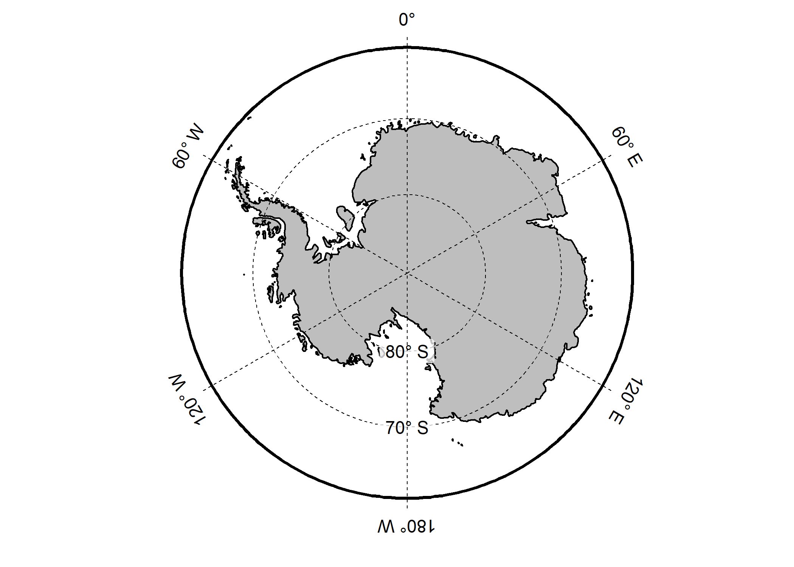
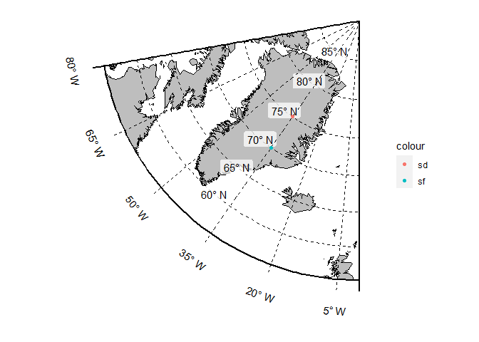
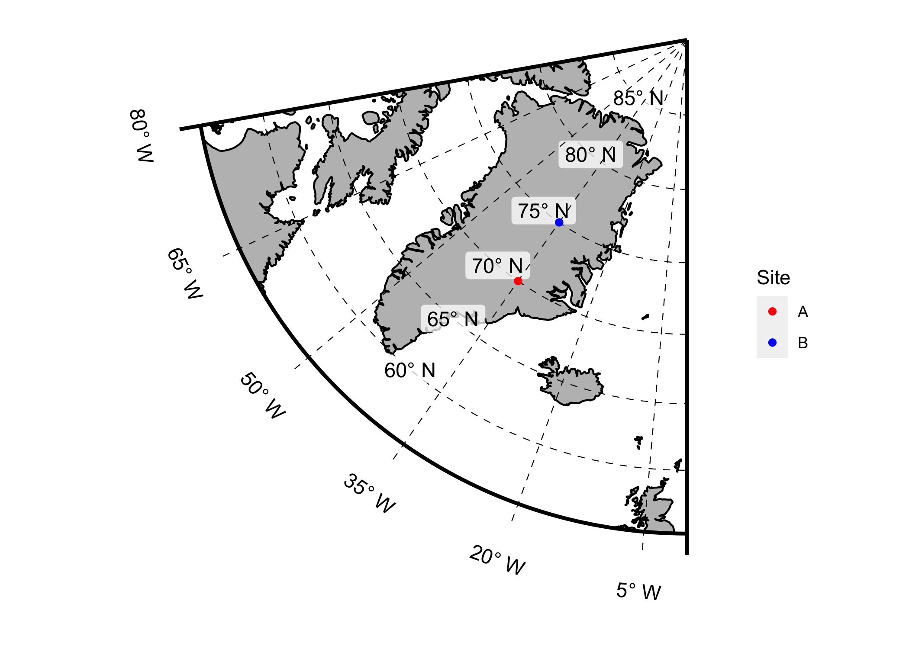
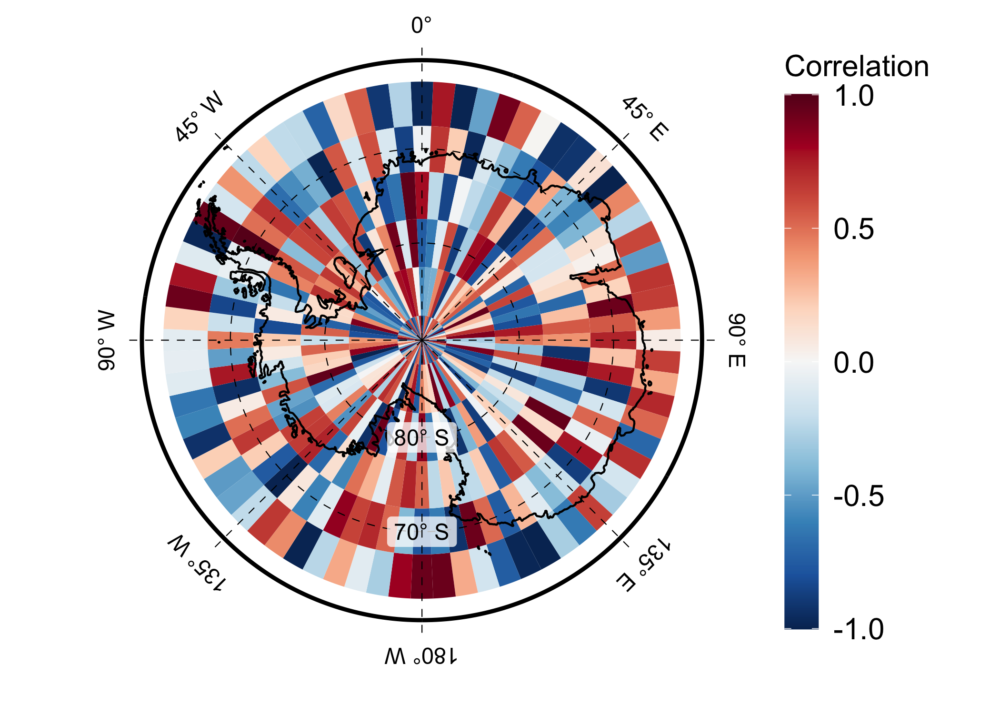

<!-- README.md is generated from README.Rmd. Please edit that file -->

# grfxtools

<!-- badges: start -->
<!-- badges: end -->

This package contains various functions to assist with the plotting of
scientific results incl. geoscientific maps; mostly applying
tidyverse/ggplot2 functionality.

## Installation

grfxtools is currently only available as the development version from
[GitHub](https://github.com/);

install with:

``` r
# install.packages("remotes")
remotes::install_github("EarthSystemDiagnostics/grfxtools")
```

## Using ggpolar

Here, a few examples of how to use the `ggpolar()` function to plot
polar stereoraphic maps of Arctic or Antarctic regions are given,
including the plotting of data alongside with it. See the ggpolar help
file for further examples and for how to customize various layout
settings.

``` r
library(ggplot2)
library(grfxtools)
```

- Plot a full north polar plot:

``` r
  ggpolar(pole = "N", max.lat = 90, min.lat = 55, n.lat.labels = 4)
#> Regions defined for each Polygons
```



- Plot a full south polar plot:

``` r
  ggpolar(pole = "S", max.lat = -60, min.lat = -90)
```



- Plot a segment with some locations marked and labelled:

``` r
  df <- data.frame(site = c("A", "B"), x = rep(-35, 2), y = c(70, 75))
  ggpolar(pole = "N", max.lat = 90, min.lat = 55,
          max.lon = 0, min.lon = -80,
          longitude.spacing = 15, n.lat.labels = 5) +
    geom_point(aes(x, y, colour = site, group = site), data = df) +
    scale_colour_manual(values = c("red", "blue"), name = "Site")
#> Regions defined for each Polygons
```



Note that segment plots can easily be rotated such that the line along
the mean longitude of the segment is vertical by setting
`rotate = TRUE`.

- If you want to add points or a spatial field of data to a ggpolar
  plot, it can be convenient to create that plot separately and then
  provide it as an argument to ggpolar, so that it can be added to the
  polar plot internally:

``` r
  # create some dummy data
  nx <- 360 / 5
  ny <- 30 / 5

  lon <- seq(0, 355, length.out = nx)
  lat <- seq(-65, -90, length.out = ny)

  set.seed(718624)
  df <- data.frame(lon = rep(lon, times = ny), lat = rep(lat, each = nx),
                   dat = runif(n = nx * ny, min = -1, max = 1))

  # Colorbrewer2 colour scales for plotting the "correlation" data can be
  # obtained directly with the respective grfxtools function
  colour.scale <- ColorPal("RdBu", rev = TRUE)

  # create ggplot for data
  p <- ggplot() +
    geom_tile(aes(x = lon, y = lat, fill = dat),
              data = df, colour = "transparent") +
    scale_fill_gradientn(colours = colour.scale,
                         limits = c(-1, 1), name = "Correlation") +
    theme(legend.key.height = unit(0.75, units = "inches"),
          legend.text = element_text(size = 15),
          legend.title = element_text(size = 15),
          text = element_text(size = 15))

  # plot data projected on south polar map
  ggpolar(pole = "S", data.layer = p,
          max.lat = -60, min.lat = -90, n.lat.labels = 3,
          longitude.spacing = 45,
          land.fill.colour = "transparent")
```


