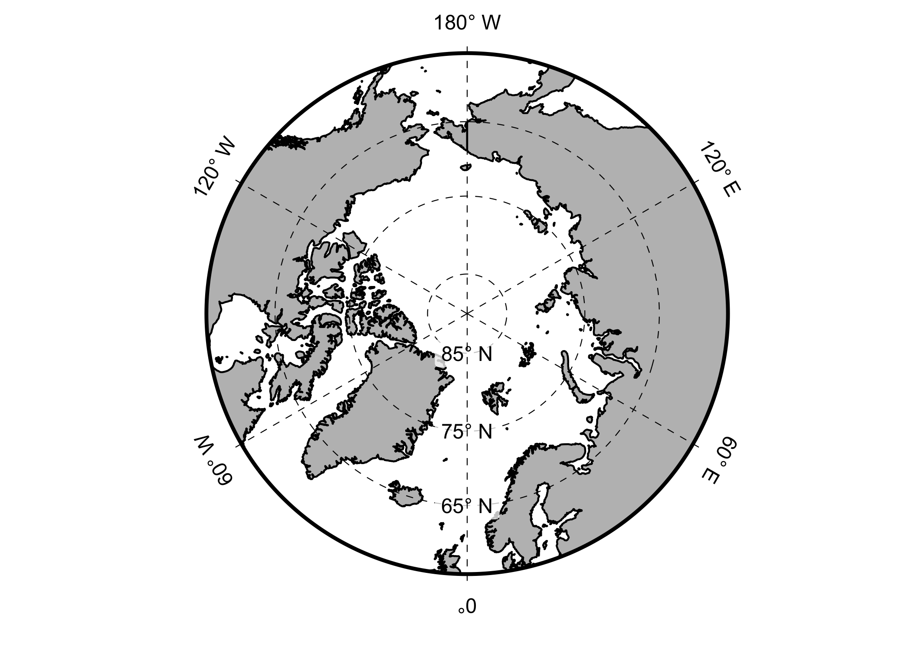

<!-- README.md is generated from README.Rmd. Please edit that file -->

# grfxtools

<!-- badges: start -->
<!-- badges: end -->

This package contains various functions to assist with the plotting of
scientific results incl. geoscientific maps; mostly applying
tidyverse/ggplot2 functionality.

## Installation

grfxtools is currently only available as the development version from
[GitHub](https://github.com/)

Install with:

``` r
# install.packages("remotes")
remotes::install_github("EarthSystemDiagnostics/grfxtools")
```

## Using ggpolar

``` r
library(ggplot2)
library(grfxtools)

ggpolar(pole = "N", max.lat = 90, min.lat = 55, n.lat.labels = 4)
#> Regions defined for each Polygons
```


``` r
ggpolar(pole = "S", max.lat = -60, min.lat = -90)
```



``` r
ggpolar(pole = "N", max.lat = 90, min.lat = 55,
        max.lon = 0, min.lon = -80,
        longitude.spacing = 15, n.lat.labels = 5) +
   geom_point(aes(x = -35, y = 75, colour = "sd")) +
   geom_point(aes(x = -35, y = 70, colour = "sf"))
#> Regions defined for each Polygons
```

 See
the ggpolar help file for more examples.
